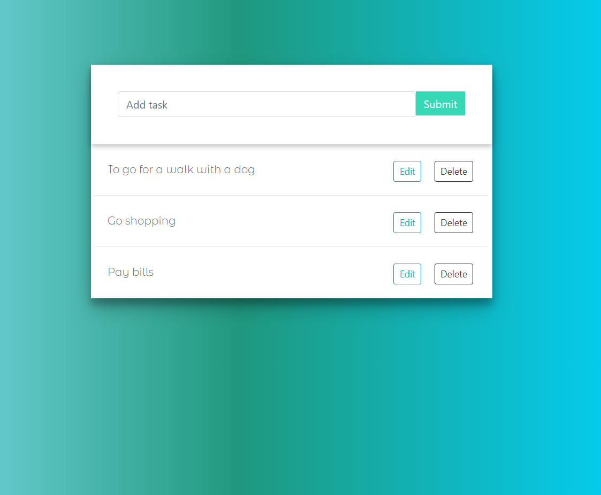

# ToDoApp
A very simple and basic to-do application which makes use of browsers localstorage.
#### Frontend
- Bootstrap, CSS, JS, Ajax
#### Backend
- Python, 3.7, Django 3.0, Django REST Framework sqlite3;

#### About 
The aim of this project is to gain basic knowledge about work frontend with backend, how to use 
JS and Ajax with Django REST Framework and how to create right API. 

##### Dependencies
- Python 3.6+
- Django 3.0
- Django REST Framework

### Manual
- Install Django and Django REST Framework(if not already installed)
`pip install django`
`pip install djangorestframework`

### Contribute
...